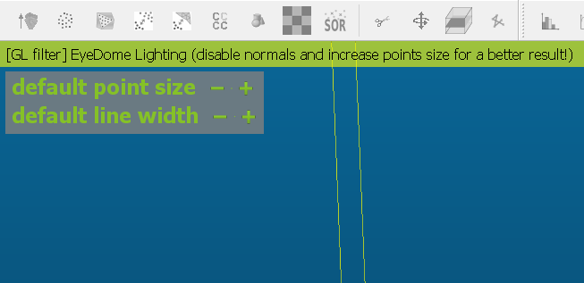
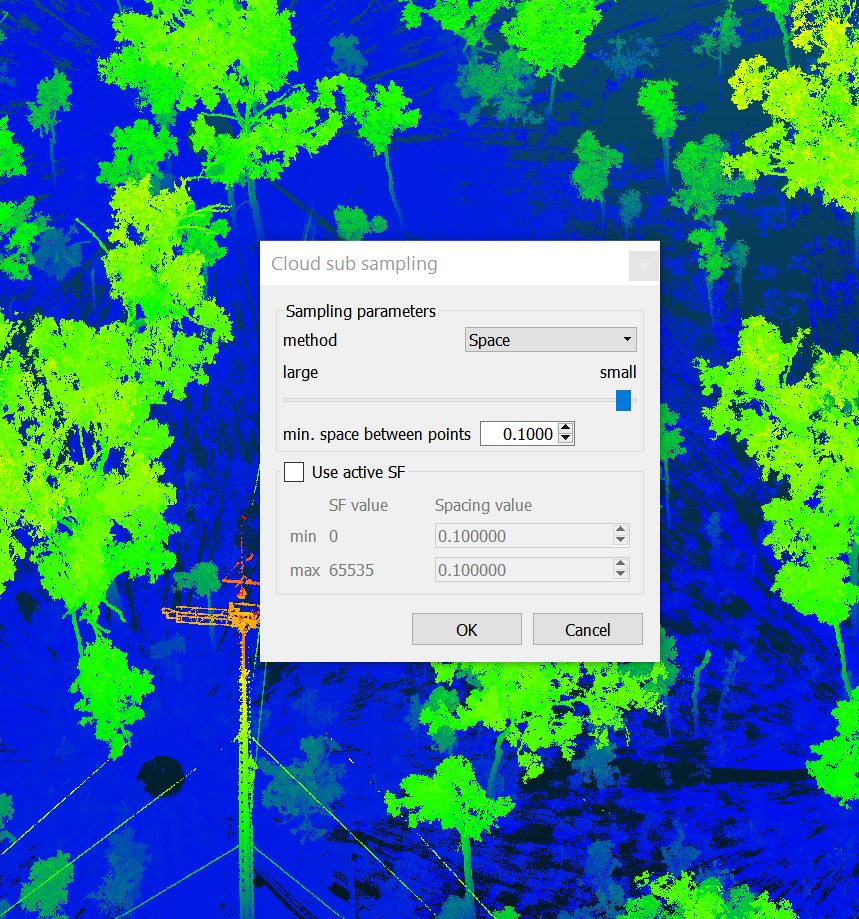

# Introduction to Remote Sensing of the Environment

## Lab 11 - Working with Terrestrial Laser Scanning (TLS) data in CloudCompare - ecological application

### Prerequisites
---
Completion of this lab exercise requires use of the CloudCompare software package. CloudCompare is a powerful package for visualising and processing point-clouds, and best of all is open-access. You can download the version to match your operating system here:

https://www.danielgm.net/cc/

---
### Background and objective
The objective is to apply the skills obtained in Labs 9 and 10 in an ecological context. In the previous Labs we were looking at a likely familiar location - the Boab court at CDU Casuarina campus. Here we will align three scans of the Litchfield site you have seen in the lectures and register them using the ICP algorithm.

Scan data can be downloaded in .las format here (file size ~ 260 MB):

Scan 17 | Scan 26 | Scan 27

---
## Getting to know CloudCompare

Please see last week's lab here: [Lab 9](https://github.com/geospatialeco/GEARS/blob/master/Intro_RS_Lab9.md)

## Merging multiple point clouds

Please see last week's lab here: [Lab 10](https://github.com/geospatialeco/GEARS/blob/master/Intro_RS_Lab10.md)

## Ecological application
**1. Import Scan 17.**
   * Inspect the cloud

Notice how RGB works better for low points. As tree foliage sways in the wind between acquisition of the RGB image and the point cloud we often get a beautiful sky blue assigned to our tree tops.

**2. Explore Display settings.** 
  * Toggle the EDL filter *(Display -> Shaders & Filters -> EDL filter)*
  * Adjust point size (hover mouse in top left corner of the screen to show menu)

Working with LiDAR data, different settings will be useful for different purposes. During this prac you can adjust display settings to your personal preference.

**Fun fact:** Next to the scan point in the centre you will see a termite mound built up on a tree trunk. After this scan was taken large areas of Litchfield NP were subject to bushfires during the 2019 dry season. 

Here is a photo taken this year during a repeat scan from the same position. At this stage only a small piece of charcoaled timber remains of this large tree. After another fire there will likely be no visible evidence of a tree having been there.

Consecutive LiDAR scans can be useful for quantifying change over time in wooded systems. In this example we can record loss of large trees; other applications include quantification of tree growth or the impact of fire events on the understory.

**3. Import Scan 26.**
   * Select point cloud in top left panel
   * Change colour to height ramp *(Edit -> Colours -> Height ramp)*
   * Repeat for all point clouds

For the remainder of this lab I recommend using a height ramp to display the point clouds.
As these point clouds are not georeferenced, CloudCompare will overlap the files. As in Lab 10 we will move and rotate them to align.

**4. Open the Translate and Rotate tool.**
   * Select Scan 26
   * Select Translate/ Rotate tool
   * In the tool deselect Tz
   * From the Rotation drop-down menu select Z

These settings will allow you to move the point cloud along the x/y-axes and rotate it along the z-axis.

**5. Align point clouds.**
   * Use your **secondary** mouse button to move and your **primary** mouse button to rotate
   * Click the green tick in the Translate/ Rotate tool to save changes
   * If necessary, change viewing angle and repeat process for further adjustment

You can see the impact of trees swaying in breezy conditions and sight differences in scanning angles. When scanning wooded areas, it's best to scan on a wind still day or time of day if possible. 
Perfect alignment is difficult using my manually translating and rotating. Let’s import our final point cloud so we can fix those imperfections.

**6. Import and align Scan 27.**
  * Make sure you select the point cloud you want to move/ rotate in the top left panel
  * Get yourself a cuppa if you feel frustration levels are rising

Now that all three point clouds are in place we can correct minor offsets using the ICP tool. All three scans contain the tower and the shed. Scan 26 has the highest number of points for both those "landmarks", so we will be using it as reference.

**7. Fine register first point cloud.**
  * Select Scan 26 and Scan 27
  * Open the Clouds registration tool *(Tools -> Registration -> Fine registration (ICP))*
  * Make sure Scan 26 is assigned as reference - click swap if necessary
  * Change final overlap to 30%
  * Click ok

If CloudCompare displays the aligned point cloud in black, just apply the height ramp again. Inspect the alignment - notice how sharp the edges look now.

**8. Fine register second point cloud.**
  * Select Scan 26 and Scan 17
  * Repeat the process (make sure final overlap is at 30%)
  * Inspect the result - I'm sure by now you'll appreciate the neat alignment, even our shed is now complete

Notice along the edges of the point cloud how points become more sparse and large patches are blank. This is due to both, scanner range and occlusion. You can see how in forested areas the distance between individual scans will be inlfuence by stem density, while in more open country scanner range will be the limiting facor.

Along with range and occlusion I have also mentioned point density as variable to be considered. The data we are working with has been subsampled to 1 point cm-2. So let's explore how further subsampling will affect the quality of your point cloud.

**9. Reduce point density.**
   * Select your favourite point cloud
   * Open the subsampling tool *(Edit -> Subsample)*
   * In min. space between points enter 0.1000
   * Click OK
   * Inspect the result

You have just decreased point density to one point 10 cm-2. If you compare the properties in the bottom left panel you will see that points have been reduced to a fraction of the original.

How do you think does point density affect the computing power required to deal with the data?

Would this data still be useful for measuring DBH?

If DBH wasn't your primary outcome but tree height - which point density would you choose?

### Thank you

I hope you found this lab useful.

#### Cheers, Linda Luck
